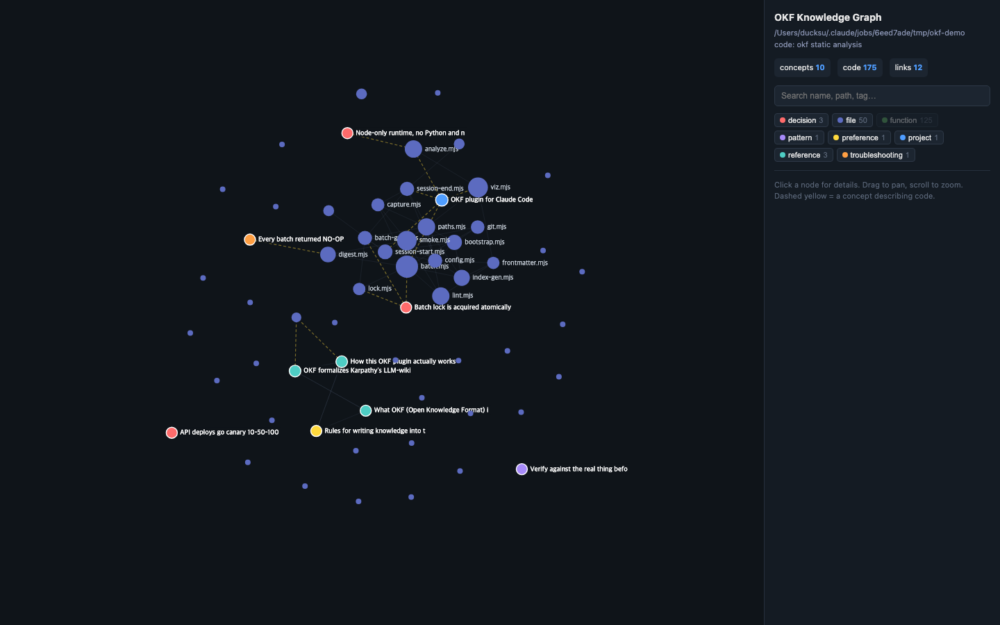
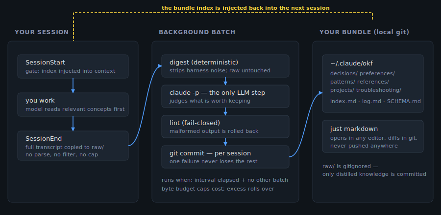

# OKF for Claude Code

**エージェントは、昨日あなたが伝えたことをすべて忘れている。これはそれを直す。しかも
出来上がる記憶は、あなたが所有する markdown のフォルダであって、囲い込まれるデータベース
ではない。**

   

**[English](README.md) · [한국어](README.ko.md) · 日本語 · [简体中文](README.zh-CN.md) · [Español](README.es.md) · [Français](README.fr.md) · [Deutsch](README.de.md) · [Português](README.pt-BR.md)**



<sub>`/okf:okf-visualize` — あなたの知識（輪郭付きのノード）とコードベースを 1 つのグラフに。
重要なのは黄色の破線エッジだ。各概念が、実際にそれについて書かれているソースファイルへ
リンクされている。</sub>

セッションは毎回ゼロから始まる。同じアーキテクチャ上の決定、同じデプロイ方針、同じ
「それは試したが壊れた」を説明し直す。そしてセッションが終わった瞬間、それはまた消える。
一方で、その質問に答えられた*はず*の知識は、wiki やコードコメント、そして Google の OKF
発表の言葉を借りれば「数人のシニアエンジニアの頭の中」に散らばっている。

このプラグインは、そのループを自動的に閉じる。実際に話した内容をキャプチャし、再利用できる
部分を構造化されたナレッジバンドルへ蒸留し、その知識を毎セッションの開始時にモデルの前へ
戻す。

## フォーマット

知識は **[OKF (Open Knowledge Format)](https://github.com/GoogleCloudPlatform/knowledge-catalog/blob/main/okf/SPEC.md)** で保存される。
Google Cloud が [2026 年 6 月に公開した](https://cloud.google.com/blog/products/data-analytics/how-the-open-knowledge-format-can-improve-data-sharing/?hl=en&utm_source=pytorchkr&ref=pytorchkr)
オープン仕様だ（v0.1 Draft、Apache-2.0）。意図的に平凡であり、そこが肝だ。

> "The format is intentionally minimal: a directory of markdown files with YAML
> frontmatter. There is no schema registry, no central authority, and no required
> tooling. **If you can `cat` a file, you can read OKF; if you can `git clone` a
> repo, you can ship it.**"

OKF は、その 10 週間前に [Andrej Karpathy がスケッチした](https://gist.github.com/karpathy/442a6bf555914893e9891c11519de94f)
「LLM wiki」パターンを形式化したものだ。Google の発表がそう明言している。公開以降、
ジェネレータ、リンター、ビューア、MCP サーバーからなる[小さなエコシステム](https://github.com/search?q=%22open+knowledge+format%22&type=repositories)
がその周りに形成され、フォーマットは Google の外にも現れている（AWS には Glue データベースを
OKF バンドルとして提供する[サンプル](https://github.com/aws-samples/sample-okf-llm-wiki)がある）。
まだ初期段階で、そのエコシステムの大半は数週間前にできたものだ。それでもフォーマットは主張
どおりのことをしている。作者のツールがなくても読める、ということだ。

**なぜメモリ製品ではなくフォーマットなのか。** mem0、Letta、Zep、Cognee といったツールは
メモリ*ランタイム*だ。ライブラリを組み込むかサービスをホストすると、記憶はそのベクトルストア
やグラフストアの中に置かれる。競合ではなく別のレイヤーであり、そのいくつかは OKF を保存する
こともできるだろう。実務上の違いは**離脱コスト**だ。グラフ DB に埋め込まれた知識はその
システムからしか読めないが、OKF バンドルはエディタで開き、GitHub でレンダリングされ、
プルリクエストで差分が出て、変換を挟まずに他のどのエージェントからも読める。このプラグインが、
唯一のコピーを預けてくれと求めることはない。

## 何をするか

1. セッションが終わるとき、その全会話を無損失で**キャプチャする**。
2. キャプチャしたセッションをバックグラウンドで**圧縮する**（cron やスケジュールタスクでは
   なく、機会があれば走るバッチジョブ）。`claude -p` を使って再利用可能な知識 —
   decisions、project facts、preferences、patterns、references、troubleshooting — を抽出する。
3. そのバンドルのインデックスを、新しいセッションのコンテキストへ必須のゲートとして
   **注入する**。これにより Claude は、関連する作業に取りかかる前に過去の関連知識を実際に
   読む。毎回ゼロから始めることがなくなる。
4. バンドルとコードベースを 1 つのグラフとして**可視化する**。各概念を、それが実際に対象と
   しているファイルへリンクする（`/okf:okf-visualize`）。

すべては `~/.claude/okf`（または `$CLAUDE_CONFIG_DIR/okf`）配下のローカル git リポジトリに
置かれる。どこにも push されない。発生するネットワーク通信は、あなたがすでに行っている
Anthropic API への呼び出しだけだ。バッチ処理も、ローカルで実行されるもう 1 回の
`claude -p` 呼び出しにすぎない。

## 必要なもの

- プラグインをサポートする Claude Code
- Node.js（`claude` 自体がすでに要求するもの。追加のランタイムは不要）
- git

`npm install` の手順はない。外部サービスもない。使い始めるのに設定も要らない。

## インストール

```
claude plugin marketplace add dja1369/okf-system
claude plugin install okf@okf-marketplace
```

（代わりにローカルのクローンからインストールする場合は `claude plugin marketplace add /path/to/your/clone`。）

これだけだ。セッションを再起動すれば、ゲートとキャプチャのフックが有効になる。次のセッション
開始時に、バンドルは自動的にブートストラップされる（`~/.claude/okf` 配下に基本構造を持つ
ローカル git リポジトリが作られる）。

アンインストールは `claude plugin uninstall okf`。`~/.claude/okf` のデータはそのまま残る。
ただの git リポジトリなので、中を見るのもバックアップするのも、`rm -rf ~/.claude/okf` で
手動削除するのも自由だ。

## 使い方

通常の利用にあなたの操作は要らない。キャプチャとバッチ圧縮は自動で行われる。手動での確認・
制御用に 5 つのコマンドがある。**`okf:` プレフィックスに注意**。これらはプラグインスコープの
コマンドなので必須だ。

| コマンド | 何をするか |
|---|---|
| `/okf:okf-status` | 最後のバッチ実行、待機中のセッション、ロック状態を報告する |
| `/okf:okf-batch` | バッチを即座に強制実行する（インターバルのゲートは無視するが、ロックは尊重する） |
| `/okf:okf-config` | 現在の設定を表示し、編集できるようにする |
| `/okf:okf-index` | バンドルの読みやすい概要を出力する — すべてのカテゴリと概念のタイトル、加えて最近の `log.md` の変更 |
| `/okf:okf-visualize [パス]` | バンドルとコードベースを 1 つのインタラクティブなグラフとして描画する（自己完結型 HTML） |

インストール直後のバンドルは空ではない。OKF そのもの、このプラグインのアーキテクチャ、
バンドルの記述ルールを説明する概念がシードされた状態で配布される。だからゲートは最初の
セッションから実体のあるものを指し示せるし、バンドルは自分自身をドキュメント化している。

## 可視化

`/okf:okf-visualize` は、あなたの知識とコードを 1 つのグラフとして描画する。面白いのはどちらの
半分でもない。その間を結ぶ破線のリンクが、各概念を、それが実際に語っているソースファイルへ
つなぐ。

[Understand-Anything](https://github.com/Egonex-AI/Understand-Anything) がすでにリポジトリを
解析済みなら（`.understand-anything/` または `.ua/knowledge-graph.json`）、その LLM で要約された
より豊かなグラフが使われる。そうでなければ、このプラグイン自身のアナライザが構築する。純粋な
Node のみでネイティブモジュールはなく、JS/TS、Python、Go、Rust、Java/Kotlin、Ruby、PHP、
C/C++、C#、Swift からファイル、関数、クラス、そして import グラフを抽出する。

出力は自己完結型の HTML ファイルだ。CDN なし、ネットワークリクエストなし、バックエンドなし。
オフラインで開く。自分のナレッジベースを開くのに、どこかへ通信する必要などないからだ。

## 仕組み



- **キャプチャ**は純粋なファイルコピーだ。パースもフィルタリングもサイズ上限もない。
  `SessionEnd` のたびに、トランスクリプト全体が `raw/` に入る。これは意図的な設計だ。何が
  起きたかの部分的な記憶から作られたナレッジベースは、無いよりも悪い。
- **圧縮**はバッチ時にのみ、作業用のコピーに対して行われる。キャプチャされた原本には一切
  触れない。ツールアクセスは `Read/Glob/Grep/Write/Edit` に制限され（`Bash` はなし）、その
  1 回の呼び出しに限って*あなたの*他のフック、プラグイン、MCP サーバーはすべて無効化される
  （`--safe-mode`）。そのため、自分自身をキャプチャするループに陥ることがない。
- **ゲート**は、コンパクトなカテゴリインデックス（概念の全文ではない）と最近の変更を注入し、
  関連する作業に手をつける前に該当ファイルを実際に `Read` するよう Claude に指示する。
  インデックスだけでは、古くなった前提のまま動くには足りない。
- 構造リンターがバンドルを常に仕様準拠に保つ。バッチ実行が不正な形式を残すことになる場合、
  コミット前に自動でロールバックされる。

フォーマットの背景と設計思想については、Google Cloud の [Open Knowledge Format 発表](https://cloud.google.com/blog/products/data-analytics/how-the-open-knowledge-format-can-improve-data-sharing/?hl=en&utm_source=pytorchkr&ref=pytorchkr)を参照。YAML frontmatter を持つただの markdown
ファイルであり、どんなツールでも読め、このプラグイン固有のものではない。

## 設定

`~/.claude/okf/.okf/config.md` を直接編集する（frontmatter）か、`/okf:okf-config` を使う。

| キー | デフォルト | 意味 |
|---|---|---|
| `enabled` | `true` | マスターの on/off スイッチ（キャプチャ、ゲート、バッチのすべてがこれに従う） |
| `batch_interval_hours` | `1` | バッチ実行の最小間隔 |
| `batch_max_digest_kb` | `600` | 1 回の実行あたりのダイジェスト総バイト数の予算 — 実質的なコスト上限。予算を超えたセッションは次の実行に回る |
| `batch_max_sessions` | `50` | 安全上の上限にすぎない。実際に調整するのは `batch_max_digest_kb` |
| `seed_language` | `en` | 最初のブートストラップでシードされる概念の言語（`en`、`ko`。不明な値は `en` にフォールバック） |
| `batch_model` | `claude-sonnet-5` | バッチ取り込みに使うモデル。空なら CLI のデフォルト |
| `batch_effort` | `medium` | バッチ取り込みの推論エフォート（`low`/`medium`/`high`/`xhigh`/`max`）。空なら CLI のデフォルト |
| `capture_exclude_cwd` | `[]` | キャプチャをスキップするディレクトリの glob パターン（オプトアウト専用 — キャプチャ自体が部分的になることはない） |
| `batch_digest_cap_kb` | `150` | LLM に渡す要約のセッションごとのサイズ上限（キャプチャされた原本に上限はかからない） |
| `remove_candidate_ttl_days` | `30` | 処理済みの raw トランスクリプトを削除するまで保持する期間 |
| `inject_max_lines` / `inject_max_bytes` | `120` / `16384` | ゲート注入のサイズ上限 |
| `claude_bin` / `node_bin` | *(空)* | 環境で `PATH` の解決に失敗する場合の絶対パス上書き |

## データとプライバシー

- すべてはローカルに留まる。`~/.claude/okf` はそれ自体が独立したただの git リポジトリで、
  あなたがたまたま作業しているリポジトリとは完全に別物だ。**このプラグインのどのコードパスも、
  それに対して `git push`、`git remote add`、その他ネットワーク関連の操作を実行することは
  ない**。どこであれ使われる git 操作は `init`、`commit`、`checkout`、`clean` だけだ
  （検証可能: `grep -n "push\|remote" lib/*.mjs bin/*.mjs` — ヒットするのは無関係な
  `Array.push()` の呼び出しだけ）。あなたが自分で意図的に `git push` しない限り、バンドルが
  マシンの外に出ることはない。
- バッチ処理は、要約と抽出を行うためにセッションの内容を Anthropic API へ送る。普段の
  Claude Code の利用がすでに通信しているのと同じ API に、`claude -p` の呼び出しが 1 回
  増えるだけだ。サードパーティのサービスは関与しない。
- `raw/`（キャプチャされたトランスクリプト全体）と、処理済みだが削除待ちのトランスクリプトは
  git-ignore され、コミットされない。コミットされるのは、抽出されたナレッジバンドルだけだ。

## ポータビリティ

パスがハードコードされている箇所は 1 つもない。すべて `os.homedir()` /
`process.env.CLAUDE_CONFIG_DIR` / `process.env.HOME` を通して解決されるので、別のマシンや
ユーザーアカウントに新規インストールすれば、そこには独立したバンドルができる。これはテスト
スイート（`test/smoke.mjs`）が、隔離された `HOME`/`CLAUDE_CONFIG_DIR` の
サンドボックス上で検証している。その中には **git の identity がまったく設定されていない**
ケースも含まれる。プラグインはあなたの `user.name`/`user.email` に依存しない。自身の自動
コミットには、常に固定の合成 identity（`OKF Batch <okf-batch@localhost>`）を使う。macOS と
Linux はこの方法で直接検証されている。Windows 固有の処理（`claude.cmd` のための
`shell:true`、パス区切り文字）は設計ドキュメントの要件どおりに実装されているが、実際の
Windows マシンではまだ実行していない。誰かが確認するまで、その組み合わせは未検証として
扱ってほしい。

## ライセンス

MIT
